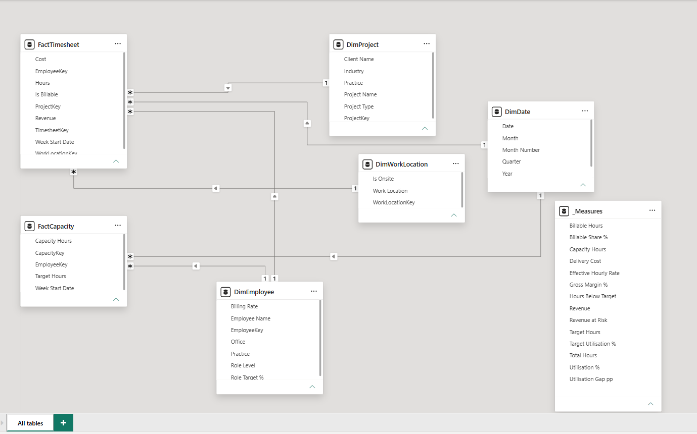
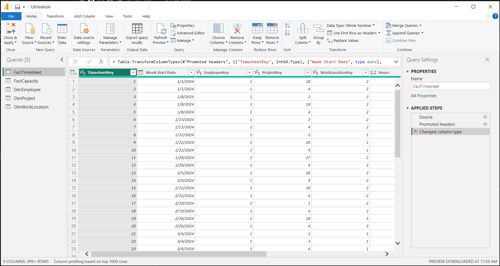

# Consultancy Utilisation & Bench Cost

**Domain:** Professional services · workforce analytics
**Tools:** Power BI Desktop · DAX · Power Query
**Status:** Complete

---

## Why this project exists

My Master's thesis — [*Optimizing Resource Planning in Hybrid Knowledge Work*](https://trepo.tuni.fi/handle/10024/232515), Tampere University, 30 credits, grade 4/5 — researched how to plan resources when knowledge workers split their time between office, home and client site.

The research produced a model but no instrument. **This is the instrument.**

---

## The decision this dashboard drives

> *Which practice is leaking capacity, and what is it costing us?*

## The problem

Every consultancy runs on utilisation, and most report it as one company-wide percentage. Two things go wrong with that.

**A single average hides the practice that is idle.** A firm at 63% looks uniformly mediocre when in fact three practices are near target and one is 24 points below it.

**One target for everyone is the wrong test.** A principal carrying 55% billable is performing exactly as intended — their week is meant to include selling, mentoring and account work. A junior at 55% is a problem. Measured against a blanket 75%, the principal looks like a failure and the junior looks acceptable. Both readings are wrong.

So this report measures every person against **their own role's target**, then prices the gap.

---

## What the report shows

The firm is at **62.7% utilisation against a 71.5% target — 8.8 points short.**

That gap is worth **€2,280,493** in unbilled capacity. And it is not spread evenly:

| Practice | Utilisation | Target | Gap | Revenue at risk |
|---|---:|---:|---:|---:|
| **Design** | **48.2%** | 72.1% | **−23.9 pp** | **€1,851,313** |
| Data | 65.3% | 69.9% | −4.6 pp | €284,754 |
| Advisory | 72.0% | 76.4% | −4.4 pp | €177,627 |
| Delivery | 69.0% | 69.9% | −0.9 pp | €69,278 |

> **These four rows come to €2,382,972, not €2,280,493 — and that is not an error.** The shortfall *hours* are additive; the money is not. Each practice values its own gap at its own realised rate, while the firm card values all 19,155 hours at the blended €119.06. The €102,479 difference is Design's rate premium: it carries 77% of the shortfall and bills €6.34 above the blend. The headline keeps the blended rate as the more conservative of the two figures.

**Design is 28% of the firm and 77% of the shortfall** — 14,763 of 19,155 unbilled hours.

It is also getting worse. Delivery holds steady around 69–70% for two years while Design slides:

| | 2024 Q1 | Q2 | Q3 | Q4 | 2025 Q1 | Q2 | Q3 | Q4 |
|---|---|---|---|---|---|---|---|---|
| **Design** | 52% | 51% | 51% | 51% | 49% | 47% | 43% | **42%** |
| Delivery | 70% | 70% | 69% | 68% | 68% | 69% | 69% | 69% |

Design also bills at the **highest** effective rate in the firm — **€125.40/hour**, against a firm blend of €119.06. Its idle capacity is the expensive kind.

### The same problem, seen through roles

| Role | Utilisation | Own target | Gap |
|---|---:|---:|---:|
| Principal | 53.9% | 55% | −1.1 pp |
| Manager | 25.9% | 30% | −4.1 pp |
| Consultant | 71.8% | 78% | −6.2 pp |
| Junior | 69.4% | 80% | −10.6 pp |
| **Senior** | **59.5%** | **72%** | **−12.5 pp** |

Read the utilisation column alone and Manager is the firm's worst performer at 25.9%. Measured against its own 30% target it is the **second best** — and Senior, apparently unremarkable at 59.5%, is the **worst in the firm**. A manager billing a quarter of their time is doing the job as designed.

**This is the whole argument for role-specific targets, in one table.** Rank on the raw percentage and you flag the wrong people.

It is also the same finding twice over: ten of the firm's 22 seniors sit in Design, where they run **−23.9 pp**. Seniors in every other practice are within five points of target. There is no senior problem — there is a Design problem.

### The hybrid-work question

| Where the week was worked | Utilisation |
|---|---:|
| Client site | **77.2%** |
| Office | 63.6% |
| Home | 62.3% |

Client-site hours convert to billable time far more readily than hours worked from home — a 15-point gap. Office and home are almost identical, which is itself worth knowing: the split that matters is not *remote versus in-office*, it is *at the client versus not*.

> **This is an association, not a proven cause.** People are likely at a client site *because* billable work is happening there. The honest reading is that client-facing weeks and billable weeks travel together — not that sending someone to a client site creates billable work.

---

## Skills demonstrated

- **Data modelling** — star schema, two fact tables sharing a conformed employee and date dimension, single-direction relationships
- **DAX** — a target held per-person rather than averaged, a ratio converted into money, `CALCULATE` with a filter argument
- **Report design** — two pages, each answering one named question and stating its own conclusion

---

## The data

All synthetic, generated by [`data/generate_data.py`](data/generate_data.py) from a fixed seed.

```bash
pip install pandas numpy faker
python data/generate_data.py
```

| Table | Rows | Grain |
|---|---:|---|
| `FactTimesheet` | 14,799 | employee × project × week |
| `FactCapacity` | 6,300 | employee × week |
| `DimEmployee` | 60 | one employee |
| `DimProject` | 32 | one project |
| `DimWorkLocation` | 3 | office / home / client site |
| `DimDate` | 731 | one day — built in DAX, not loaded |

Period **Jan 2024 – Dec 2025**. Clean by design — Power Query is load, check types, apply.

**`Capacity Hours`, `Target Hours`, `Revenue` and `Cost` are pre-computed columns.** `Target Hours` in particular matters: it is each person's capacity at *their own* target. Averaging targets in DAX would give the wrong answer whenever the role mix differs between practices — which is exactly when the comparison matters.

Client name and industry sit on `DimProject` rather than in a separate `DimClient`. The fact table has no client key, so a client dimension would have to hang off the project dimension — and a dimension joined to another dimension is a snowflake, not a star.

---

## Documents

| File | What it is |
|---|---|
| [`docs/build-guide.md`](docs/build-guide.md) | Step-by-step build |
| [`docs/mini-brd.md`](docs/mini-brd.md) | Business requirements: As-Is / To-Be, scope, success criteria |
| [`docs/kpi-catalogue.md`](docs/kpi-catalogue.md) | Every measure — definition, formula, and the decision it supports |
| [`Utilisation.pbix`](Utilisation.pbix) | The Power BI file itself |

---

## The report

**Live report:** _link added on publish_

### Page 1 — Overview

*Are we running at the utilisation we planned?*


**62.7% sits directly beside 71.5%**, so the gap reads without a third card doing the subtraction. The trend declines from 64.1% to 61.2% across two years — Design deteriorating and pulling the firm average with it.

### Page 2 — Practice Detail

*Where is capacity leaking, and what is it costing?*


The two bar charts are the same fact told twice — first in points, then in euros. **The euros are what get a decision made.**

---

## How it was built

### The data model



Six tables, six relationships, all many-to-one with single-direction filtering.

`DimEmployee` feeds **both** fact tables, and that conformed dimension is what makes the report possible at all — `Utilisation %` divides billable hours in one fact table by capacity hours in another, so without a shared dimension the numerator and denominator would never filter together.

### Data preparation



Three steps. The data is clean by design, so preparation is type checking rather than repair.
