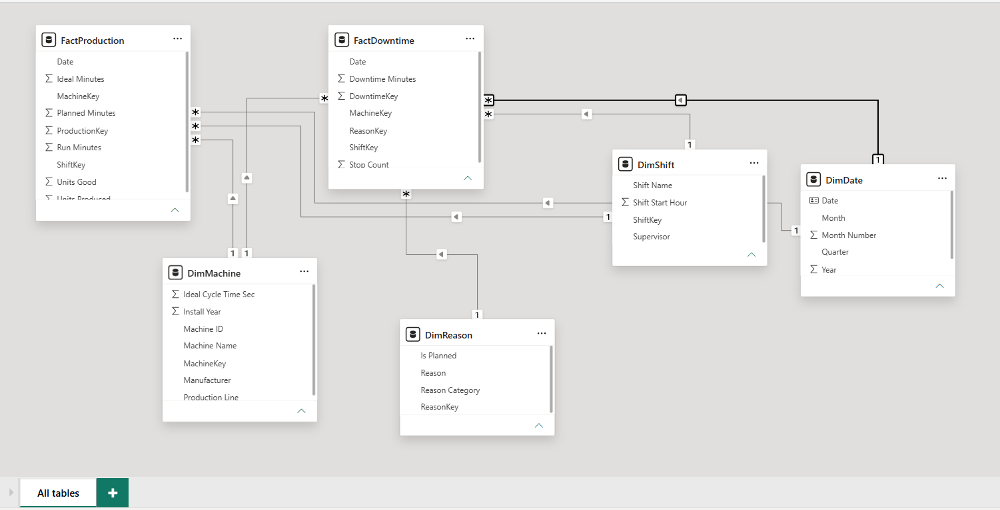
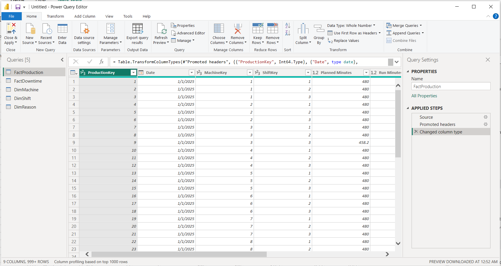

# Smart Textile Factory — OEE & Downtime

**Domain:** Manufacturing · IoT · ERP
**Tools:** Power BI Desktop · DAX · Power Query
**Status:** Complete

---

## The decision this dashboard drives

> *Which machine and shift should the next improvement week target — and is the problem the equipment or the way it is being run?*

## The problem

*Aurora Textiles Oy* is a fictional Finnish textile mill: 12 machines across three lines — Spinning, Weaving, Finishing — running three shifts a day.

The plant reports OEE monthly as a single number. That number tells a supervisor something is wrong but never what, because it fuses three different losses with three different owners:

| Loss | Owner | Question it answers |
|---|---|---|
| **Availability** | Maintenance | Is the machine stopping? |
| **Performance** | Production | Is it running slower than it should? |
| **Quality** | QA | Is it making scrap? |

Reported together, nobody is accountable for any of them. Downtime is likewise reported in total hours rather than by reason, so improvement effort gets spread evenly instead of aimed at the few causes that dominate.

## What the report shows

Plant **OEE is 71.0%** against a world-class benchmark of 85% — a 14-point gap.

```
Availability 84.2%  ×  Performance 85.7%  ×  Quality 98.4%  =  OEE 71.0%
```

Quality is not the problem. Availability is, and the report locates it precisely:

**1. `WEV-03` is failing.** The oldest rapier loom has the lowest OEE in the plant at **51.3%**, and it is not stable — it declines every quarter:

| 2025 Q1 | Q2 | Q3 | Q4 | 2026 Q1 | Q2 |
|---|---|---|---|---|---|
| 61.9% | 59.9% | 52.0% | 48.3% | 44.1% | **41.7%** |

That is the signature of an asset heading for an unplanned failure, and the case for intervening before it stops entirely.

**2. Finishing changeovers take twice as long at night.** Same machines, same products, different result — measured as *average duration per changeover*, not total minutes:

| Line | Morning | Evening | Night | Night ÷ Morning |
|---|---:|---:|---:|---:|
| **Finishing** | **38.3 min** | 38.5 min | **83.3 min** | **2.17×** |
| Spinning | 35.9 min | 38.4 min | 37.8 min | 1.05× |
| Weaving | 43.0 min | 42.5 min | 44.4 min | 1.03× |

The other two lines show no shift difference at all. **That contrast is what makes it a training and process problem rather than an equipment one** — answering it with maintenance spend would fix nothing.

> Measured as an average rather than a total on purpose. Night shift records more stoppages on every line, so total changeover minutes would show all three lines somewhat worse at night and blunt the comparison. The average isolates *duration*, which is what the finding claims.

---

## Skills demonstrated

- **Data modelling** — star schema, two fact tables sharing conformed dimensions, single-direction relationships, dedicated date table
- **DAX** — a composite multiplicative KPI decomposed into its three components, `CALCULATE` with a filter argument, `SWITCH(TRUE(), …)` banding
- **Report design** — two pages, each answering one named question and stating its own conclusion

---

## The data

All synthetic, generated by [`data/generate_data.py`](data/generate_data.py) from a fixed seed — reproducible with one command.

```bash
pip install pandas numpy
python data/generate_data.py
```

| Table | Rows | Grain |
|---|---:|---|
| `FactProduction` | 19,152 | machine × date × shift |
| `FactDowntime` | 53,634 | machine × date × shift × reason |
| `DimMachine` | 12 | one machine |
| `DimShift` | 3 | one shift |
| `DimReason` | 10 | one stoppage reason |
| `DimDate` | 546 | one day — built in DAX, not loaded |

Period **Jan 2025 – Jun 2026**, with a two-week plant shutdown in July 2025.

**The data is clean by design** — no nulls, no duplicates, no inconsistent spellings. Power Query here is load, check types, apply.

`Ideal Minutes` arrives as a **pre-computed column**. Deriving it in DAX needs `SUMX` with `RELATED` against each machine's cycle time; as a column, `Performance %` is a single `DIVIDE`.

---

## Documents

| File | What it is |
|---|---|
| [`docs/build-guide.md`](docs/build-guide.md) | Step-by-step build, written for someone new to Power BI |
| [`docs/mini-brd.md`](docs/mini-brd.md) | Business requirements: As-Is / To-Be, scope, success criteria |
| [`docs/kpi-catalogue.md`](docs/kpi-catalogue.md) | Every measure — definition, formula, and the decision it supports |
| [`SmartFactory.pbix`](SmartFactory.pbix) | The Power BI file itself |

---

## The report

**Live report:** _link added on publish_

### Page 1 — Plant Overview

*Is the plant running at the standard it should?*


`Biggest Loss` names the dominant problem in one card — **availability**, not speed or scrap. The reason chart then locates it: **Changeover, Mechanical Failure and Yarn Break are 65% of all stop time**, so the improvement week has one place to aim rather than nine.

### Page 2 — Loss Analysis

*Which machine and shift — and is it equipment or process?*


Two findings, each with its own evidence and its conclusion written on the page.

---

## How it was built

### The data model



Six tables, seven relationships, all many-to-one with single-direction filtering. `DimMachine` and `DimShift` each feed both fact tables — the conformed-dimension pattern, which is what lets one machine selection filter production and downtime together.

### Data preparation



Three steps. The data is clean by design, so the preparation work is type checking rather than repair — and `Ideal Minutes` arrives pre-computed so `Performance %` stays a single `DIVIDE`.
