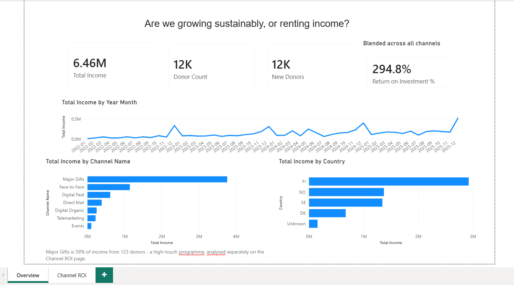
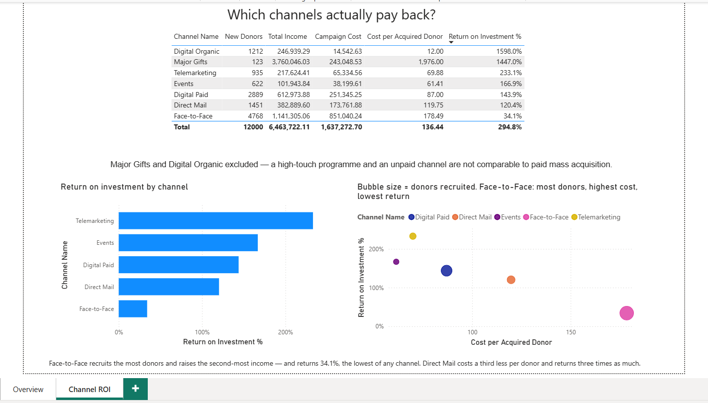
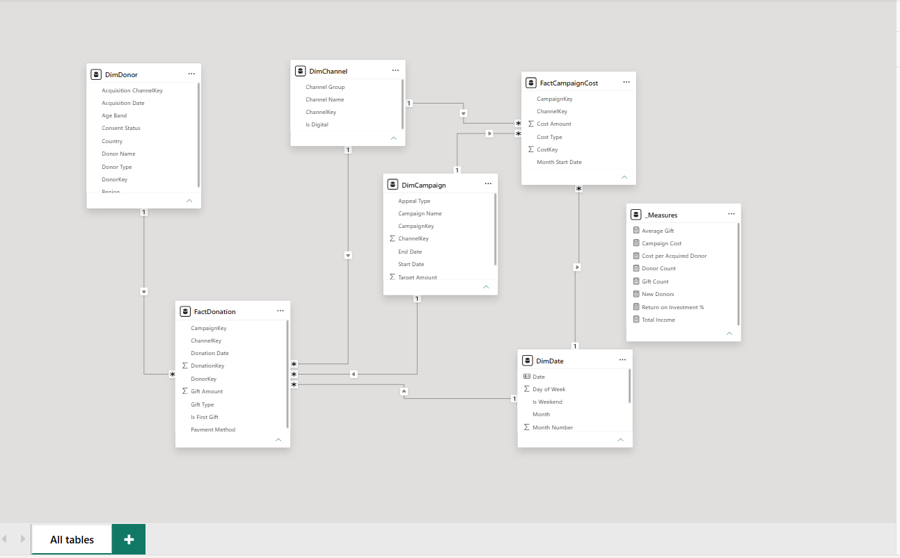
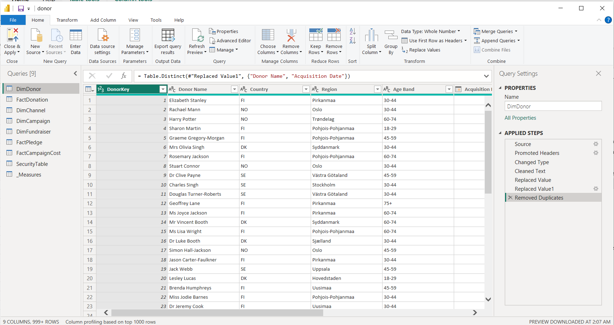

# Donor Retention & Fundraising Performance

**Domain:** Nonprofit fundraising
**Tools:** Power BI Desktop · DAX · Power Query
**Status:** Complete

---

## The decision this dashboard drives

> *Where should next year's acquisition budget go?*

## The problem

Fundraising organisations are very good at counting income and very bad at counting what it cost to raise.

A channel that recruits a large volume of donors looks excellent on gross income — it is at the top of every chart in the annual report. But if each of those donors cost three times as much to recruit as the ones from a quieter channel, the ranking is upside down and next year's budget goes to the wrong place.

*Nordic Relief Foundation* is a fictional humanitarian NGO fundraising across Finland, Sweden, Norway and Denmark through seven channels: face-to-face street teams, digital paid, digital organic, direct mail, telemarketing, events and major gifts.

## What the report shows

Face-to-Face recruits **4,768 donors** — more than any other channel — and raises **€1.14M**, the largest gross income of any mass channel. On the Overview page it looks like a strong performer.

Put cost beside it and the picture inverts:

| Channel | New donors | Income | Cost per donor | ROI |
|---|---:|---:|---:|---:|
| Digital Organic | 1,212 | €246,939 | €12.00 | 1598.0% |
| Telemarketing | 935 | €217,624 | €69.88 | 233.1% |
| Events | 622 | €101,944 | €61.41 | 166.9% |
| Digital Paid | 2,889 | €612,974 | €87.00 | 143.9% |
| Direct Mail | 1,451 | €382,890 | €119.75 | 120.4% |
| **Face-to-Face** | **4,768** | **€1,141,305** | **€178.49** | **34.1%** |

Face-to-Face is the **most expensive channel to recruit through and returns the least per euro spent** — a third of what Direct Mail returns, on a cost base nearly five times larger.

**Gross income flatters whichever channel recruits the most people.** Cost per donor and ROI are the honest measures, and they reverse the ranking.

*(Major Gifts is excluded above: 123 donors giving an average of **€30,569** each, recruited at a cost of **€1,976** per donor. A high-touch relationship programme, not a mass acquisition channel — it accounts for 58% of total income on its own.)*

---

## Skills demonstrated

- **Data modelling** — star schema, single-direction relationships, dedicated date table
- **Power Query** — missing values, duplicate records, and a documented decision on each
- **DAX** — eight measures, each formatted at the measure level and using `DIVIDE()` so a zero denominator returns blank rather than erroring the visual
- **Report design** — two pages, each answering one named business question

---

## The data

All synthetic, generated by [`data/generate_data.py`](data/generate_data.py) from a fixed seed. Real fundraising data is GDPR-regulated personal data and does not belong in a public repository, so the generator is committed instead — the dataset is reproducible with one command.

```bash
pip install pandas numpy faker
python data/generate_data.py
```

### Tables used in this build

| Table | Rows | Grain |
|---|---:|---|
| `FactDonation` | 124,742 | one gift |
| `FactCampaignCost` | 1,312 | campaign × month × cost type |
| `DimDonor` | 12,040 → 12,000 after cleaning | one donor |
| `DimCampaign` | 44 | one campaign |
| `DimChannel` | 7 | one channel |
| `DimDate` | 1,461 | one day — built in DAX, not loaded |

Period: **Jan 2022 – Dec 2025**. Total income **€6,463,722** across 12,000 donors, from 124,742 gifts.

Every file in `data/` is used by the report — five tables, no leftovers.

### Deliberate imperfections

Real data is never clean. These are planted so the preparation work has something to do — and each is a documented decision rather than a silent fix.

| Issue | Rows | Handling |
|---|---:|---|
| Missing `Country` on donors | ~360 | Relabelled `Unknown` — deleting them would understate donor counts |
| Duplicate donors, name spaced differently | 40 | Removed on name + acquisition date |
| Refunds recorded as negative gifts | 30 | Kept and netted off — a refund is a real reduction, not bad data |

---

## Documents

| File | What it is |
|---|---|
| [`docs/build-guide.md`](docs/build-guide.md) | Step-by-step build, written for someone who has never opened Power BI |
| [`docs/mini-brd.md`](docs/mini-brd.md) | Business requirements: As-Is / To-Be, scope, success criteria |
| [`docs/kpi-catalogue.md`](docs/kpi-catalogue.md) | Every measure — definition, formula, and the decision it supports |
| [`DonorRetention.pbix`](DonorRetention.pbix) | The Power BI file itself |

---

## Opening the file

`DonorRetention.pbix` contains the data, so every page renders as soon as you open it — nothing needs to be loaded first.

**Refresh is the exception.** Power BI stores the *absolute path* to each CSV in its query, so on a different machine **Home → Refresh** will fail with a file-not-found error. The report still works; only reloading from source breaks.

To repoint it:

**Home → Transform data → Data source settings → Change Source…** → select your copy of the `data` folder → **Close & Apply**

Or regenerate the CSVs first and point at those:

```bash
pip install pandas numpy faker
python data/generate_data.py
```

The seed is fixed, so the regenerated files are identical to the ones committed here.

---

## The report

**Live report:** _link added on publish_

### Page 1 — Overview

*Are we growing sustainably, or renting income?*



The monthly line shows the Christmas appeal landing every December — roughly a quarter of annual income in a single month.

### Page 2 — Channel ROI

*Which channels actually pay back?*



The scatter carries the finding in one mark: **Face-to-Face is the largest bubble, furthest right, and lowest down** — most donors recruited, highest cost each, worst return.

---

## How it was built

### The data model



**Six tables, seven relationships.** Every one is many-to-one with single-direction filtering, running from a dimension to a fact — never dimension to dimension, and never back up from a fact. That is what keeps it a star rather than a snowflake, and it is why filters behave predictably.

`DimDate` is built in DAX and marked as a date table, so Power BI treats it as the single authority on dates rather than generating a hidden one behind every date column.

| From | To |
|---|---|
| `FactDonation[DonorKey]` | `DimDonor` |
| `FactDonation[ChannelKey]` | `DimChannel` |
| `FactDonation[CampaignKey]` | `DimCampaign` |
| `FactDonation[Donation Date]` | `DimDate` |
| `FactCampaignCost[ChannelKey]` | `DimChannel` |
| `FactCampaignCost[CampaignKey]` | `DimCampaign` |
| `FactCampaignCost[Month Start Date]` | `DimDate` |

`DimChannel` and `DimCampaign` each feed both fact tables — the conformed-dimension pattern, and what allows income and cost to be compared side by side on the Channel ROI page.

### Data preparation



Each step is a decision recorded in the [KPI catalogue](docs/kpi-catalogue.md) — missing countries relabelled rather than deleted, duplicates removed on name *plus* acquisition date, refunds kept and netted off.
